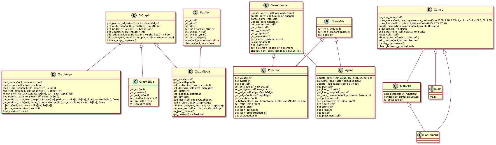

# oop-ex5


## How to Run the Code:

The command below executes the simulator.
`stage number` should be replaced with a number between 0 and 15.

```shell
pip install -r requirements.txt
java -jar Ex4_Server_v0.0.jar <stage number>
python src/main.py
```

## Contributors

Eitan Kats, Adi Yafe, Ori Howard

## Game Details

In this assigment we were asked to create a Pokémon game. The game is displayed on a directed graph and has 16 levels (
0-15).   
Each level has a different number of agents and Pokémons.

The Algorithms We Used:

[dijkstra](https://en.wikipedia.org/wiki/Dijkstra%27s_algorithm)

### Each Pokémon has:

value - the value of the Pokémon  
type - the type of the Pokémon indicates the direction of the edge the Pokemon is 'sitting' on  
position - the position of the Pokémon on the graph

### Each agent has:

id - the id of the agent  
value - the score of the agent (increases when the agent catches a Pokémon)  
src - the source of the agent 
dest - the destination of the agent. If the next destination has not been assigned, it
will be -1 speed - the speed of the agent  
position - represents the current position of the agent

### The Main Objectives of the Game

The goal is to navigate the agents in the directed graph in the fastest way to catch as many Pokémons as they can.

## Game Design

`GameHandler` manages the game. It decorates the client module that communicates with the server.

How we used it:

0) Fetch the information of the chosen level from the server.
1) Parse the Pokémon.
    1) Send a request to the server to get the json that represents the Pokémon and assign each Pokémon to the
       corresponding edge.
    2) Calculate the estimated location of the Pokémon on the edge (ratio).
2) Create the amount of agents participating in the current level and assign near Pokémons with the highest values.

The `GameUI` class is responsible for drawing and scaling the objects.

1) Find the minimum and maximum game proportions of the graph nodes.
2) Using the game proportions, each object is scaled and then displayed on the screen.

### The Game Loop

While the game is running:
Fetch information about the agents and Pokémons. The algorithm finds the optimal Pokémon for each agent with respect to
the speed and the amount of load on that agent. We only assign Pokémons that are not already being chased by other
agents.

In each iteration of the game loop:
If an agent has a task, the time to complete it is calculated and added to a queue. This is calculated according to the
speed and the time it will take the agent to complete the task, with respect to the current game time. The render queue
is used to call the `move` method in the server at the right time.

**Note: The time is a countdown clock of the current game level duration.**

For example: If the current time is T1, and it takes 2 seconds for the agent to pass the current edge, then the next
render time will be T1-2.

When the agent reaches the last edge in the current path, 2 timestamps are inserted to the render queue. The first is
the timestamp to catch Pokémon and the second is the time it will take to reach the destination node. The calculation of
the render time for the Pokémon catch is with respect to the ratio of the Pokémon on the edge.

## Idea of Implementation

#### We choose to represent the graph:

1. nodeMap - this is a hashmap which contains all the nodes of the graph, the key is the id of the node and the value is
   the node itself
2. parsedEdges - this is a list of the edges that are in the graph

#### Each node comprises the following:

1. pos - location of the graph node
2. id - the id of the node
3. weight - the weight of the node
4. destMap - a hashmap that maps between the nodes that this node can reach and the edges that reach them
5. sourceMap - a hashmap that maps between a node and the sources that can each is

#### Each edge comprises the following:

1. source - the id of the source node
2. dest - the id of the dest node
3. weight - the weight of the edge

## Class overview

### DiGraph

The DiGraph is used to hold the graph that is that represents the current scenario.

This graph is a directed weighted graph

### GraphAlgo

Graph Algo contains the implementation of Dijkstra (from ex-3) and additional code that loads the graph from a given
file

### GraphEdge

An object representing an edge in the graph.

### GraphNode

An object representing a node in the graph.

### Agent

This is a class that represents the agents that need to chase the Pokémon that spawn on the graph

### Pokémon

This is a class that represents the Pokémon that are spread out on the graph

### Position

Represents the location of the objects that are displayed on the screen.

This class contains methods that scale the object according to given proportions.

### GameHandler

The `GameHandler` is an implementation of the Decorator Design pattern, we Decorate the client and use the GameHandler
to communicate with the server.

The main algorithms that are being executed in the game loop are in the GameHandler.

### GameUI

The `GameUI` class is used to draw objects that participate in the game onto the screen.

The game proportions are calculated in this class by using the proportions of the graph. Objects that are drawn on the
screen are scaled here as well.

### Drawable

This is an abstract class that represents a drawable object that has a position and an icon. Mainly used to draw the
agents and Pokémon.

## Detailed Execution Details of the Algorithms

## UML



Icons were taken from : https://flaticon.com